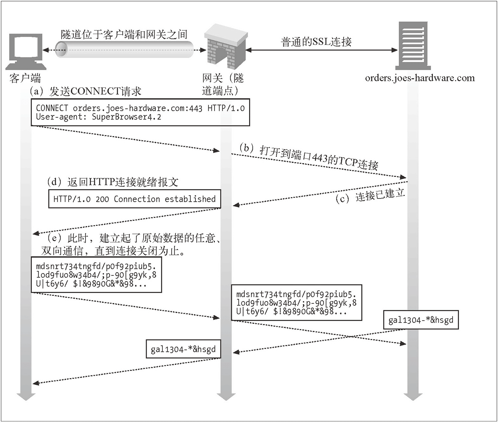

# 目的

本项目主要用于实验目的:

1. 理解HTTP代理原理
2. 熟悉Python3提供的asynio API编写异步代码

# 使用方法

由于使用了asyncio以及async和await关键字, 因此需要使用Python3.5及以上版本进行运行.

    usage: proxy.py [-h] [--hostname HOSTNAME] [--port PORT]
                    [--log-level LOG_LEVEL]

    proxy.py

    optional arguments:
      -h, --help            show this help message and exit
      --hostname HOSTNAME   Default: 127.0.0.1
      --port PORT           Default: 8765
      --log-level LOG_LEVEL
                            DEBUG, INFO, WARNING, ERROR, CRITICAL

    e.g: python3 proxy.py --hostname 10.74.120.141 --port 8888 --log-level INFO

# 原理

HTTP代理原理比较简单, 主要就是起到客户端和远程Web服务器中间消息转发. 常用的代理服务器可以对Web服务器屏蔽内部访问细节, 对Web内容进行缓存,减少网络流量等作用.

如上图所示, 代理服务器实际上就是做消息中转. 假如我通过代理A想要访问网站G, 对于网站G来说, A就是它的客户端, 它是察觉不到真实我的存在的. 在真实的代理服务器中还会对客户端的HTTP请求头做一些修改进行转发.

目前我实现的代理服务器只提供HTTP服务, 如果需要访问HTTPS网站怎么办呢?

答案是通过隧道代理, 普通的HTTP请求主要包括GET, POST等操作, 这些操作对于代理服务器来说只需要连接到对应的Web服务器, 发送相应的请求就行了. 而用户访问HTTPS网站时会首先发送CONNECT操作消息, 用于建立与远端Web服务器的连接, 连接建立后服务端会告诉客户端连接已建立, 这个时候客户端和服务端就会发送加密的hello握手消息, 建立加密连接.

这种情况下, 作为代理服务器, 只需要建立与远端服务器的连接, 连接建立后告诉客户端连接建立, 后续就只需要转发彼此之间的加密信息就行了, 基本原理如下图所示:

本项目也基本是基于以上原理进行编写的.

# TODO

- [ ] 修复故障 :)
- [x] HTTP消息头解析细化,修改转发字段
- [ ] 增加认证机制
- [ ] 增加缓存机制(maybe)
